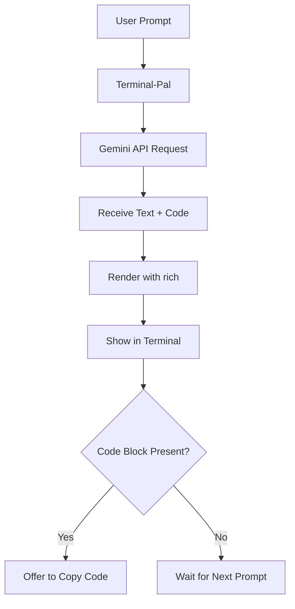

#  Terminal-Pal : Your AI Chat Companion in the Terminal

> _"An elegant, no-nonsense AI-powered assistant for your command-line grind."_  
> Powered by **Gemini 2.0** • Built with ❤️ by **Vishnupriyan**


---

##  Overview 💡

**Terminal-Pal** is a minimalist AI assistant that lives in your terminal.  
Built using Python, the `rich` library, and Gemini 2.0's API, it's your go-to pal when you want instant help, explanations, or code — all within your CLI.

Whether you're debugging, learning, or just exploring ideas, Terminal-Pal turns your terminal into an interactive AI chat space.

---

##  Features 🔥

-  **Powered by Gemini 2.0** (via Google Generative Language API)
-  Beautiful CLI output using `rich`
-  Smartly formatted and animated responses
-  Code block rendering with syntax highlighting
-  Copy-to-clipboard functionality for code
-  Conversations with memory (scroll-friendly)
-  Portable single-file script — plug and play

---

##  Workflow Diagram 🧠



---

##  Folder Structure 📁

```shell
terminal-pal/
├── terminal_pal.py         # Main app script
├── README.md               # Project documentation
├── requirements.txt        # Dependencies
```

---

##  Installation & Setup 🛠️

###  Step 1: Install Requirements 📦

```bash
pip install rich requests pyperclip
```

> Ensure Python 3.8+ is installed.

###  Step 2: Add Your Gemini API Key 🔐

Edit `terminal_pal.py` and replace:

```python
API_KEY = "PUT_YOUR_API_KEY_HERE"
```

with your API key from [Google AI Studio](https://makersuite.google.com/).

###  Step 3: Run the Script 🚀

```bash
python terminal_pal.py
```

You’re now ready to chat with your AI pal right from your terminal!

---
## 📽️ Execution Demo

[](https://github.com/user-attachments/assets/3d4a48c7-b82c-4227-811b-f987059907b0)


And if there's code, you'll get this:
```
Press 'c' to copy the code above or any other key to continue
```

---


##  License 📜

Licensed under the [MIT License](LICENSE).

---

##  Credits ✨

Built by **Vishnupriyan P R**  
If you like this, feel free to ⭐ the repo or fork it!  
Got feature ideas? Hit me up or open an issue!

---

