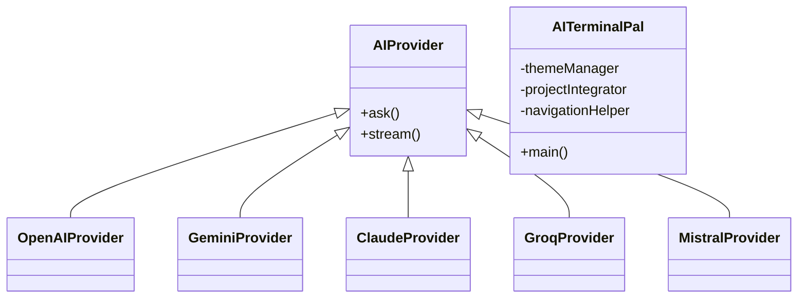

# ⚙️ AI Terminal Pal V2 – Supreme Developer Edition

> _"A developer-first, AI-integrated command-line assistant built for speed, context, and control."_  
> Powered by **Gemini 2.0**, **OpenAI GPT-4o**, **Claude Opus**, and more.  
> Crafted with ❤️ by **Vishnupriyan P R**


---

## 🚀 Executive Overview

**AI Terminal Pal V2** transforms your terminal into a next-gen AI companion — built for coders, by a coder.  
This isn’t just another CLI chatbot — it's a context-aware, multi-provider development assistant.

---

## 🧠 Architecture & OOP Design



### Modular Components:

- `AIProvider` subclasses for each AI backend
- `ThemeManager` handles terminal visuals
- `ProjectIntegrator` parses local codebase
- `NavigationHelper` manages all `/commands`

---

## 🎨 Visual Theming System

- 💼 **Professional** (blue-based)
- 🌊 **Ocean**
- 🌿 **Forest**
- ⚫ **Minimal**

Banner auto-adjusts to terminal width, with branding, model info, and project status!

---

## 📁 Folder Structure

```bash
ai-terminal-pal-v2/
├── ai terminal_pal.py         # Main app 
├── .env                    # API keys (local)
├── README.md
├── requirements.txt
```

---

## 🔧 Installation

```bash
git clone https://github.com/vishnupriyanpr183207/Terminal-Pal
cd Terminal-Pal
pip install -r requirements.txt
```

Then add your API keys to `.env`:

```env
OPENAI_API_KEY=sk-...
GEMINI_API_KEY=...
CLAUDE_API_KEY=...
(You can manually enter the api keys into the terminal itself)
```

---

## 💡 Example Usage

```bash
python terminal_pal.py
```

Sample CLI commands:

```bash
/setup            # Interactive config wizard
/ask              # Ask a quick question
/chat             # Continuous chat mode
/attach file.py   # Attach code files for context
/scan             # Analyze the whole repo
/theme forest     # Switch theme
```

---

## ⚙️ AI Feature Highlights

- ✅ 5 Provider Support (GPT-4o, Claude, Gemini, Groq, Mistral)
- 💬 Real-Time Streaming Replies
- 📋 Auto Copy-to-Clipboard for Code Blocks
- 🧠 File-aware prompts using `@filename.py`
- 📦 Context Pack Builder (auto-selects relevant files)
- 🪄 Project Scanning, Linting, Debugging, Docs Gen
- 📊 Cost + Token Analytics Dashboard
- ⚖️ Entire file less than 1 md, easy to import
- ✅ Easier to put api keys, by manually entering them while configuring
- 🗺️ Best navigation, not so complex UI

---

## 🧭 Command Structure

| Category         | Commands                                                                 |
|------------------|--------------------------------------------------------------------------|
| Setup & Config   | `/setup`, `/config`, `/provider`, `/theme`                              |
| AI Interaction   | `/ask`, `/chat`, `/generate`, `/explain`, `/improve`                    |
| File Ops         | `/attach`, `/read`, `/write`, `/edit`, `/backup`, `/copy`, `/paste`     |
| Project Insights | `/scan`, `/analyze`, `/deps`, `/metrics`, `/tree`                       |
| Dev Tools        | `/test`, `/lint`, `/docs`, `/format`, `/debug`                          |
| Reports & Export | `/export`, `/pdf`, `/history`, `/report`, `/stats`                      |
| Navigation Help  | `/nav`, `/commands`, `/help`, `/clear`, `/exit`                         |

---

## 📊 Performance Analytics

```bash
📈 Session Stats:
(Sample analytics)
- Tokens Used: 14,320
- API Cost: $0.043 USD (Depends w.r.t to the ai plans of that time)
- Models: GPT-4o (OpenAI)
- Files Attached: 4
- Commands Executed: 17
```

---

## 🛠️ Dev Utilities

- 🗃️ Project Tree Visualization
- 🧪 Unit Test Suggestions
- 📝 Auto Documentation
- 🔍 Code Quality Scoring
- ⛑️ Crash Recovery with Session Restore

---

## 🛡️ Security & Privacy

- 🔐 Local-only API key storage
- 🧼 Rate limiting + token caps
- 🚫 No external tracking or telemetry
- 🧠 Smart fallback on provider failure

---

## 📽️ Execution Preview (Coming Soon)

```bash
> /chat

User: Can you explain this Flask route?

AI: Absolutely! Here's what the `@app.route()` does in this context...
```

---

## 📜 License

This project is licensed under the [MIT License](LICENSE).

---

## 🙏 Credits

Built by **[Vishnupriyan P R](https://github.com/vishnupriyanpr183207)**  
Inspiration from CLI legends and powered by modern AI.

If you found this useful, feel free to ⭐ the repo or contribute.  
Issues, suggestions, or collabs? Hit me up!

---

> “From mockups to models — one continuum.”  
> — Vishnu, a dev who codes with caffeine ☕

